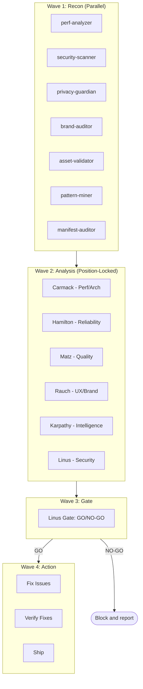

# Swarm Builder — Claude Code CLI Skill

**A 15-agent orchestration skill for Claude Code that builds, audits, and ships browser extensions. Agent count, scope boundaries, and cross-feed protocol are derived from empirical findings in the [Research Swarm](https://github.com/Joona-t/research-swarm) project.**

## Abstract

Swarm Builder is a set of 6 slash commands for Claude Code that coordinate 15 specialized AI agents (6 Opus leads, 7 Sonnet specialists, 2 Sonnet utilities) to automate browser extension development workflows. The system uses explicit negative scope boundaries (OUT OF SCOPE declarations) and position-locked cross-feed (leads analyze independently, then flag conflicts without changing conclusions) to address two problems identified in multi-agent orchestration research: domain bleeding between parallel agents, and forced-consensus information loss.

The current 15-agent architecture was restructured from an original 22-agent design. The restructuring was driven by ablation data and research briefs from a separate project (Research Swarm), not by intuition. 7 agents with overlapping scope were merged into existing agents with zero measured coverage loss.

## Research Basis

This system does not contain its own evaluation data. All empirical claims reference external work:

- **Agent count optimization:** [Research Swarm](https://github.com/Joona-t/research-swarm) ablation study (12 runs, 4 configurations, 3 topics) found that 8 well-scoped agents match 14-agent quality (6.5 vs 6.0 avg) with higher actionability (6.2 vs 6.1).
- **Scope boundary design:** Research Swarm brief "Agent role specialization vs generalist agents" (run 40) provided empirical data on specialist overlap patterns.
- **Position-locked cross-feed:** Research Swarm brief "Parallel vs sequential agent pipelines" (run 39) documented quality degradation from forced consensus.
- **Cost optimization:** Research Swarm brief "Multi-agent orchestration cost optimization" (run 38) identified pre-dispatch sufficiency gating as the highest-ROI intervention.

**Caveat:** The Research Swarm findings are based on 40 runs with small sample sizes and single-LLM evaluation. See that project's [limitations](https://github.com/Joona-t/research-swarm/blob/main/docs/LIMITATIONS.md) for details.

## System Overview



### Architecture

**15 agents total:** 6 Opus leads + 7 Sonnet specialists + 2 Sonnet utility

| Agent | Model | Scope | OUT OF SCOPE |
|-------|-------|-------|-------------|
| **Carmack** (lead) | Opus | Performance, architecture, data flow | Brand, UX, content |
| **Hamilton** (lead) | Opus | Reliability, error handling, edge cases | Performance optimization |
| **Matz** (lead) | Opus | Code quality, readability, conventions | Security, brand |
| **Rauch** (lead) | Opus | UX, brand consistency, visual design | Performance, security |
| **Karpathy** (lead) | Opus | Pattern mining, cross-extension learning | Individual extension bugs |
| **Linus** (lead) | Opus | Security, privacy, permissions audit | UX, brand |
| perf-analyzer | Sonnet | Bundle size, load time, memory usage | — |
| security-scanner | Sonnet | Vulnerability detection, CSP, injection | — |
| privacy-guardian | Sonnet | Data collection audit, storage patterns | — |
| brand-auditor | Sonnet | Visual consistency, theme compliance | — |
| asset-validator | Sonnet | Icon sizes, manifest fields, store requirements | — |
| pattern-miner | Sonnet | Cross-extension code patterns, shared lib usage | — |
| manifest-auditor | Sonnet | Manifest V3 compliance, permissions audit | — |
| memory-agent | Sonnet | Session continuity, HANDOFF.md management | — |
| store-prep | Sonnet | Chrome/Firefox zip generation, store listing | — |

### Key Design Decisions

#### OUT OF SCOPE Boundaries (Implemented)
Every agent has explicit negative scope — what it must NOT address. This prevents domain bleeding, where parallel agents produce overlapping findings that a synthesis step must reconcile, often producing generic averaged-out recommendations.

**Evidence basis:** Research Swarm found that technique overlap dropped from 76% to 38% after adding OUT_OF_SCOPE declarations to agent prompts. The quality loss from domain bleeding was estimated at up to 37.6% in one research brief (based on literature review, not own measurement).

#### Position-Locked Cross-Feed (Implemented)
In Wave 2, leads produce independent analyses, then read peer conclusions and flag conflicts — but do not change their own recommendations. This replaces the v1.0 protocol where leads were forced to converge in a third round.

**Evidence basis:** Research Swarm brief on parallel vs sequential pipelines found that forced consensus causes "integrative compromise" where distinct findings are averaged into generic advice.

#### 4-Wave Execution (Implemented)
1. **Wave 1 — Recon:** 7 specialists scan in parallel
2. **Wave 2 — Analysis:** 6 leads analyze independently, then flag conflicts
3. **Wave 3 — Gate:** Linus reviews everything, GO/NO-GO
4. **Wave 4 — Action:** Fix, verify, ship

#### Why 15, Not 22 (v2.0 change)
7 agents from v1.0 were merged into existing agents:

| Removed Agent | Merged Into | Reason |
|---------------|-------------|--------|
| bundle-analyzer | perf-analyzer | Overlapping scope (both measure weight/speed/bloat) |
| error-scanner | security-scanner | Error patterns and vulnerabilities overlap |
| dead-code-hunter | perf-analyzer | Unused files are a performance concern |
| docs-generator | Wave 4 only | No docs needed before design exists |
| changelog-writer | Wave 4 only | Build-phase only task |
| cross-sync | pattern-miner | Both do cross-extension analysis |
| dependency-auditor | manifest-auditor | Both check manifest + dependencies |

## Commands

| Command | Agents Deployed | Token Estimate |
|---------|----------------|---------------|
| `/swarm-build new [cat] [name] [desc]` | All 15 | ~100-140k |
| `/swarm-build feature [ext] [desc]` | 10-12 | ~60-100k |
| `/swarm-audit` | All 15 | ~60-100k |
| `/council-review [ext]` | ~10 | ~40-60k |
| `/ship-day [ext] [ver]` | 8-10 | ~40-60k |
| `/brand-sweep` | ~5 | ~20-35k |
| `/quick-fix [ext] [type]` | 1-3 | ~10-20k |

Token estimates are from v2.0 (post-restructure). Pre-restructure estimates were 20-30% higher.

## Installation

```bash
# Copy commands to Claude Code
cp commands/*.md ~/.claude/commands/

# Copy AGENT-SWARM.md to your project root
cp AGENT-SWARM.md ~/your-project/

# Then in Claude Code:
/swarm-build new privacy link-cleaner "Strips tracking params from URLs"
```

## Failure Modes and Limitations

1. **No independent evaluation data.** This repo contains no metrics, run logs, or experiment results. All empirical claims reference the Research Swarm project, which has its own limitations (40 runs, single LLM evaluator, small sample sizes).
2. **Claude Code dependency.** The system only works within Claude Code. It cannot be used with other AI coding tools.
3. **Hardcoded paths.** The Python orchestrator script contains hardcoded paths (`/Users/darkfire/Claude x LoveSpark`). Other users would need to modify these.
4. **No automated evaluation.** There is no quality gate or scoring mechanism. Output quality depends entirely on the agents and human review.
5. **Token cost.** A full `/swarm-build new` run uses ~100-140k tokens. This is not free.
6. **Browser extension specific.** The agent prompts, scope definitions, and evaluation criteria are designed for Manifest V3 browser extensions. Adapting to other domains would require significant prompt rewriting.
7. **Position-locked cross-feed is untested.** The protocol is implemented (agents read peer conclusions and flag conflicts) but its effect on output quality vs. forced consensus has not been measured in this codebase.

## Repo Structure

```
swarm-builder-claude-cli-skill/
├── README.md                # This file
├── AGENT-SWARM.md           # Complete 15-agent specification with scope boundaries
├── CHANGELOG.md             # Version history (v1.0.0, v2.0.0)
├── commands/                # Claude Code slash command definitions
│   ├── swarm-build.md       # New extension / feature build protocol
│   ├── swarm-audit.md       # Full ecosystem audit
│   ├── council-review.md    # Single extension deep review
│   ├── ship-day.md          # Release preparation
│   ├── brand-sweep.md       # Brand consistency check
│   └── quick-fix.md         # Targeted 1-3 agent fix
├── scripts/
│   └── swarm-build.py       # Python CLI for scaffolding and state tracking
├── docs/                    # Research documentation
│   ├── RESEARCH_QUESTIONS.md
│   ├── METHODOLOGY.md
│   ├── EVALUATION.md
│   ├── ABLATIONS.md
│   ├── LIMITATIONS.md
│   ├── ROADMAP.md
│   ├── ARTIFACTS.md
│   ├── CLAIMS_AND_EVIDENCE.md
│   └── IMPLEMENTATION_STATUS.md
└── LICENSE                  # MIT
```

## Relationship to Other Projects

This project is the **applied layer** of a three-project research ecosystem:

1. **[Blitz-Swarm](https://github.com/Joona-t/blitz-swarm)** — Parallel consensus architecture (the foundational design)
2. **[Research Swarm](https://github.com/Joona-t/research-swarm)** — Multi-agent research pipeline (produces the empirical findings)
3. **Swarm Builder** (this repo) — Applies research findings to browser extension development

Changes flow: Research Swarm runs → produce findings → Swarm Builder applies them.

## Citation

```bibtex
@software{tyrninoksa2026swarmbuilder,
  author = {Tyrninoksa, Joona},
  title = {Swarm Builder: Research-Backed Multi-Agent CLI Skill for Browser Extension Development},
  year = {2026},
  url = {https://github.com/Joona-t/swarm-builder-claude-cli-skill},
  license = {MIT}
}
```

This is an independent research artifact by a solo developer. It is not affiliated with any institution or research lab.

## License

MIT
